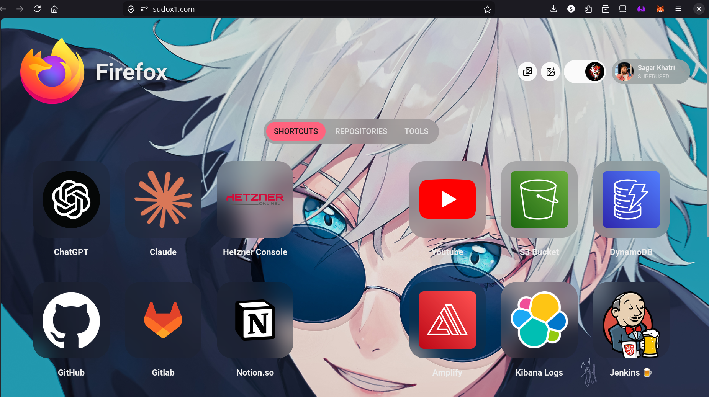
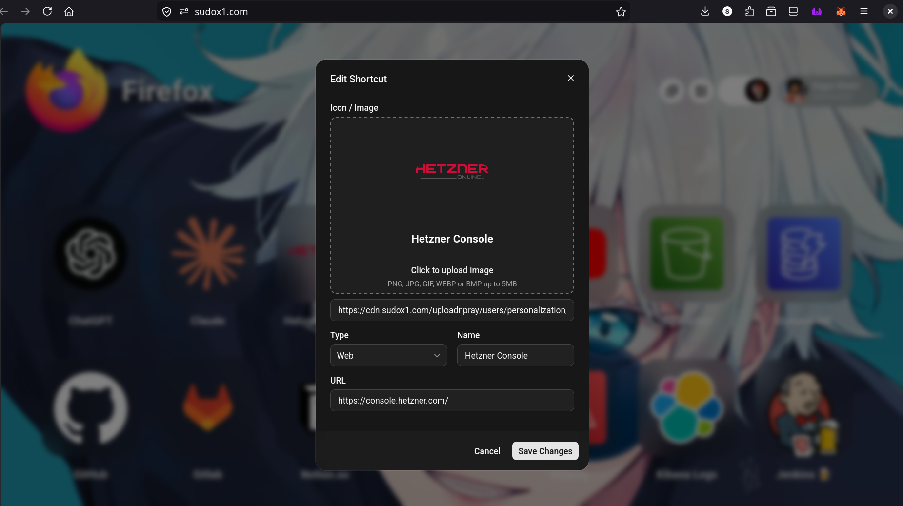
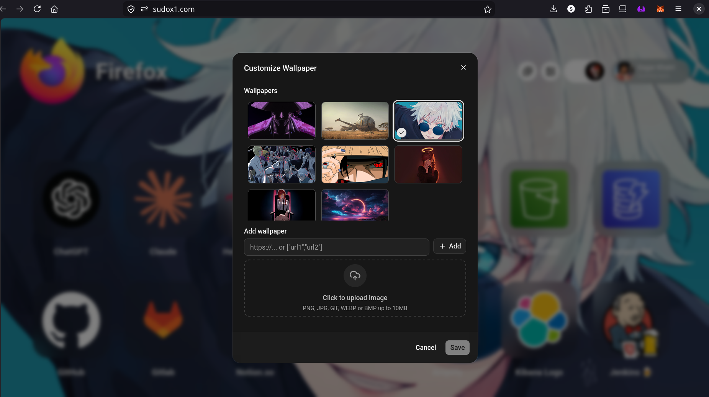

<div align="center">

# 🚀 **LIVE @**

# **👉 https://sudox1.com 👈**

### **Experience CursedHome in your browser right now.**

<a href="https://sudox1.com">
  
</a>

<br>

---

# 🏠 CursedHome

### **Your browser. Your rules. Zero clutter.**

*A modern, self-hosted homepage for developers and power users.*

</div>

---

<p align="center">
  <a href="https://sudox1.com">
    
  </a>
</p>

<p align="center">
  <strong>⭐ Stop opening the same 20 tabs every morning.</strong><br>
  Launch everything from one beautiful dashboard.
</p>

---

# ✨ Features

## 🔐 One Login. Forever.

Forget logging in every few days.

* 🚀 Dedicated SSO authentication
* ♻️ Automatic refresh tokens
* 📧 Email OTP verification
* 🔑 Forgot password support
* 👤 Profile picture uploads

---

## ⚡ Your Shortcuts, Your Way

Build a homepage that works the way **you** do.

* ➕ Add unlimited shortcuts
* ✏️ Edit them anytime
* 🖼️ Upload custom icons
* 🎯 Keep everything beautifully organized

<p align="center">
  
</p>

---

## 🎨 Wallpapers That Match Your Mood

A homepage should never be boring.

* 🌄 Upload your own wallpapers
* 🎭 Switch backgrounds whenever you like
* ✨ Personalize every new tab

<p align="center">
  
</p>

---

## 🪄 Drag. Drop. Done.

Reorder your shortcuts effortlessly.

No settings.

No complicated menus.

Just drag, drop, and you're done.

---

## 🌐 Two Types of Shortcuts

### 🔗 Web Shortcuts

Your everyday websites, always one click away.

* ChatGPT
* Claude
* YouTube
* Amazon
* Gmail
* Reddit
* ...and literally any website.

---

### 📦 Repository Shortcuts

Built for developers.

Save direct links to your repositories—not just GitHub pages.

```text
https://github.com/sagarkpro/CursedBackend
https://gitlab.com/company/backend-api
https://codeberg.org/user/project
```

Open your codebase in a single click.

---

# 🔐 Built-in SSO

CursedHome includes a modern authentication system designed for seamless sign-ins.

* 🔄 Refresh Token Grant
* ⚛️ Compatible with the React Auth0 SDK
* 📧 Email Verification
* 🔑 Forgot Password
* 👤 Profile Picture Uploads

---

# 💜 Why CursedHome?

Because browser homepages shouldn't look like they were designed in 2012.

Whether you're a developer, student, designer, or someone with way too many bookmarks, CursedHome keeps everything you need exactly where you expect it.

Fast.

Beautiful.

Personal.

Always one click away.

---

<div align="center">

## ⭐ If you like CursedHome, consider giving the repository a Star!

It helps others discover the project and motivates future updates. 💜

</div>
